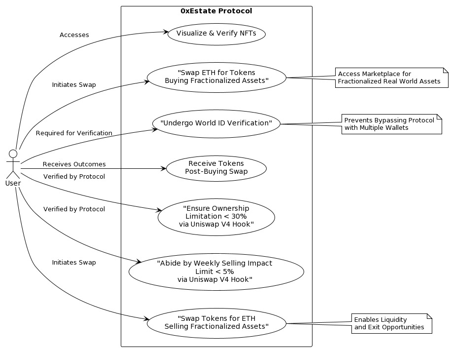
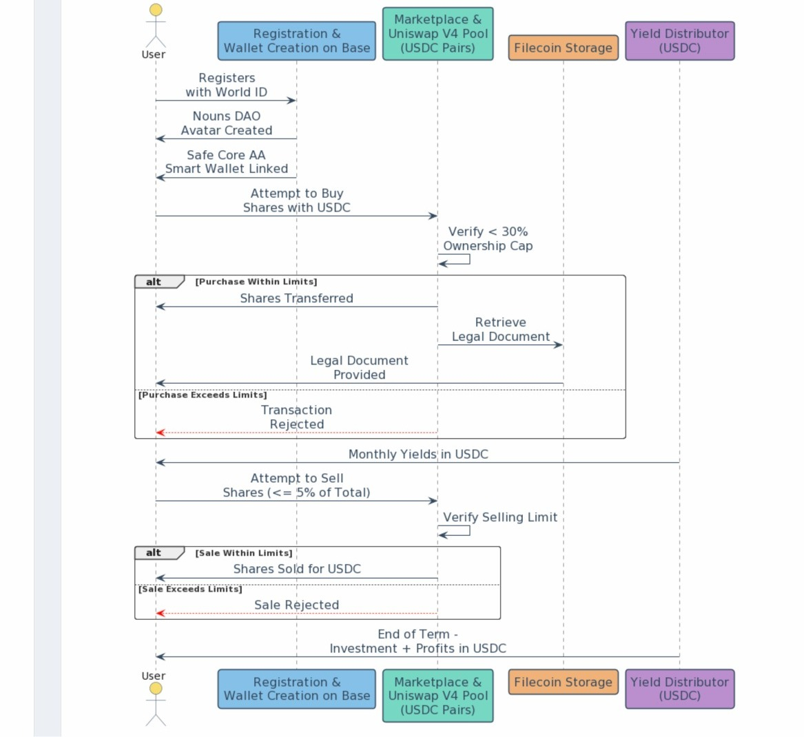
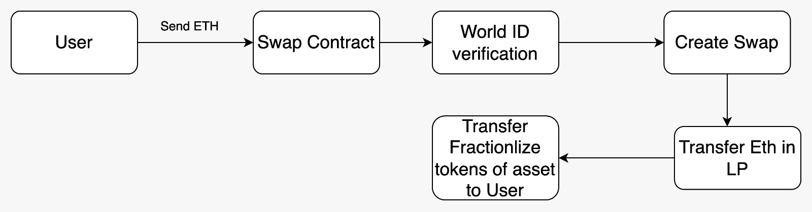
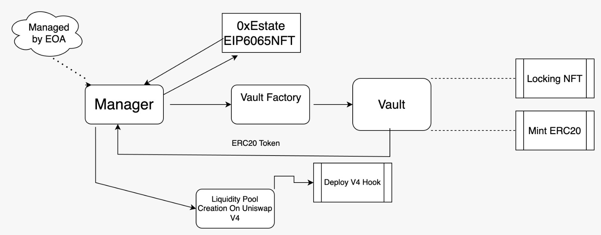

# 0xEstate Protocol Interaction and Process Descriptions

## Image 1 - Flowchart of 0xEstate Protocol

The flowchart details the user interaction and verification processes within the 0xEstate Protocol, a platform for fractionalized real estate investment using blockchain technology. It depicts several steps a user goes through when interacting with the protocol, starting with accessing the system and ending with receiving outcomes. Key activities include visualizing and verifying NFTs, swapping Ethereum (ETH) for tokens, and undergoing World ID Verification to prevent a single user from bypassing the protocol with multiple wallets and owning more than 30% of the assets. The Uniswap V4 Hook is a crucial part of the protocol, ensuring compliance with ownership limitations and selling impact limits, which are set to less than 30% and 5% respectively. The protocol facilitates liquidity and provides exit opportunities for the users by allowing them to swap tokens for ETH when selling fractionalized assets.

## Image 2 - Sequence Diagram for Investment Platform

The sequence diagram illustrates the process flow of a user's interaction with a blockchain-based investment platform, focusing on the purchase and sale of shares. The user registers, creates an avatar, and links a wallet. Buying and selling shares are subject to verification to ensure adherence to ownership caps and selling limits. Monthly yields are distributed, and at the end of the investment term, the user receives their investment plus profits in USDC.

## Image 3 - Cryptocurrency Swap Process Diagram

This simple flow diagram illustrates a user's interaction with a cryptocurrency swap mechanism, which is a common process in decentralized finance (DeFi) platforms. The user sends Ethereum to a Swap Contract, which, after World ID verification, creates a swap, transfers Ethereum into a Liquidity Pool (LP), and then transfers fractionalized tokens of another asset to the user.

## Image 4 - Platform Architecture for Digital Asset Management

The diagram represents the architecture and flow of operations for a platform that manages digital assets using blockchain technology. It involves a Manager component, interaction with NFTs, a Vault Factory to create Vaults for asset custody, functions for locking NFTs and minting ERC20 tokens, and the creation of a liquidity pool on Uniswap V4.

